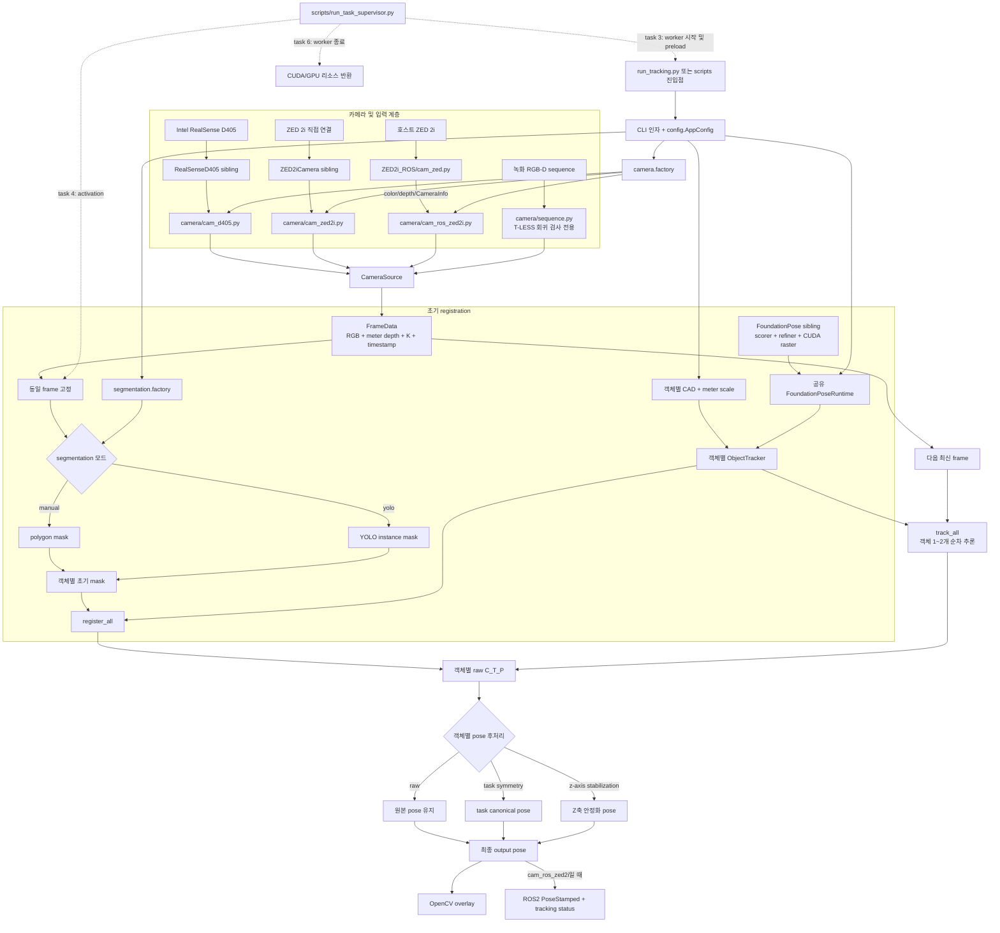

# MULTI_OBJECT_TRACKING

RGB-D 카메라 영상에서 Pipe 1~2개의 6D pose를 실시간으로 추정하고 추적하는
애플리케이션이다. 카메라 종류와 관계없이 RGB, meter 단위 depth, intrinsic을
공통 형식으로 변환하고, 수동 polygon 또는 YOLO instance segmentation으로 초기
mask를 만든 뒤 FoundationPose registration과 tracking을 수행한다.

최종 pose에는 조립 작업용 symmetry 처리 또는 Z축 안정화를 적용할 수 있으며,
화면 overlay와 ROS2 pose/status 토픽으로 결과를 제공한다. 직접 실행뿐 아니라
unit task 3에서 미리 준비하고 task 4에서 동작을 시작해 task 6에서 GPU 리소스를
반환하는 supervisor 실행도 지원한다. 실제 정확도와 처리 속도는 CAD 품질,
초기 mask, 카메라 환경, FoundationPose 설정에 따라 달라진다.

## 전체 pipeline



핵심 계약은 `FrameData`다. 어느 카메라를 선택해도 RGB `uint8`, meter 단위
depth `float32`, 3x3 intrinsic `K`로 변환된 뒤 같은 segmentation 및
FoundationPose 경로로 들어간다. 두 객체 모드도 카메라 frame은 한 번만 얻지만,
공유 scorer/refiner/CUDA context의 안전을 위해 객체별 FoundationPose 추론은
현재 순차 실행한다.

## 현재 지원 범위

| 구분 | 지원 항목 | 비고 |
|---|---|---|
| 실시간 카메라 | `cam_ros_zed2i` | 기본값. 호스트 `ZED2i_ROS` publisher의 ROS2 토픽을 구독한다. |
| 실시간 카메라 | `cam_zed2i` | `ZED2iCamera`와 ZED SDK를 이용해 같은 프로세스에서 직접 획득한다. |
| 실시간 카메라 | `cam_d405` | `RealSenseD405`와 librealsense를 이용해 직접 획득한다. |
| 오프라인 입력 | `SequenceFrameSource` | `scripts/test_tless_smoke.py` 회귀 검사 경로이며 `--camera-type` 선택지는 아니다. |
| 객체 수 | 1개 또는 2개 | `SUPPORTED_OBJECT_COUNTS = (1, 2)`. 현재 실행 script는 Pipe용 CAD/ID를 사용하며 3개 이상은 거부한다. |
| 초기 mask | `manual`, `yolo` | 수동 polygon 또는 사용자 학습 YOLO instance segmentation. YOLO detection 모델은 지원하지 않는다. |
| pose 연산 | `register`, `track` | 첫 고정 frame에서 registration 후 이후 frame에서 tracking한다. |
| 단일 객체 후처리 | task symmetry 기본, Z축 안정화 선택 | `--z-axis-stabilization`을 주면 기본 task canonicalization 대신 Z축 안정화를 사용한다. `--task-symmetry-debug`는 진단 출력이다. |
| 이중 객체 후처리 | raw 기본, task symmetry 또는 Z축 안정화 선택 | `--task-symmetry-output`과 `--z-axis-stabilization`은 동시에 사용할 수 없다. |
| 실행 방식 | 직접 실행, task supervisor | supervisor는 task 3 preload, task 4 activation, task 6 종료 정책을 사용한다. |
| 출력 | OpenCV overlay, 조건부 ROS2 pose/status | ROS2 출력은 `cam_ros_zed2i`에서 제공한다. 이중 객체는 `--left-pipe-object-id`가 필요하다. |

현재 제공하지 않는 기능은 3개 이상 객체, YOLO 자동 재등록, 객체별 병렬
FoundationPose 추론, detection box만 이용한 registration이다. YOLO의 좌우 배정은
초기 ID 규칙일 뿐, 장기적인 re-identification이나 robot hand identity 추론이
아니다.

## 디렉터리별 역할

    ../FoundationPose/ 필수 pose 추정 및 tracking engine
    ../RealSenseD405/  선택 D405 영상 획득 의존성(SDK 및 센서 도구)
    ../ZED2iCamera/    선택 ZED 2i 직접 획득 의존성(ZED SDK adapter)
    ../ZED2i_ROS/      선택 ZED 2i 호스트 ROS2 publisher
    camera/           카메라 공통 계약과 장치별 adapter
    segmentation/     수동 또는 YOLO 초기 registration mask
    pose_estimation/  FoundationPose 연동 경계와 pose 결과
    pose_processing/  조립 작업용 pose 후처리
    tracking/         객체 수명주기와 단일·이중 객체 실행 관리
    visualization/    OpenCV pose overlay
    pose_logging/     ROS pose/status 출력 계층
    scripts/          하드웨어 확인 및 tracking 실행 진입점
    ros2/             ROS2 설정과 연동 문서
    doc/              프로젝트 사용 문서

출력 패키지 이름은 `logging`이 아니라 `pose_logging`이다. 최상위
`logging` 패키지는 Python 표준 라이브러리를 가려 FoundationPose 및 외부
라이브러리 import를 망가뜨릴 수 있다.

## Sibling 저장소와 설치

권장 workspace 배치는 다음과 같다. 실제 디렉터리 이름은
`ZED2i_Camera`가 아니라 `ZED2iCamera`다.

```text
Pipe_Align_kkb/
├── FoundationPose/          # 필수: pose 추정 및 tracking
├── MULTI_OBJECT_TRACKING/   # 현재 애플리케이션
├── RealSenseD405/           # 선택: D405 직접 입력
├── ZED2iCamera/             # 선택: ZED 2i SDK 직접 입력
└── ZED2i_ROS/               # 선택: 호스트 ZED 2i ROS2 publisher
```

| Sibling | 필요 여부 | 사용하는 경우 | 책임 |
|---|---|---|---|
| `FoundationPose` | **필수** | 모든 pose registration/tracking | NVIDIA 모델, scorer/refiner, CUDA raster 및 native extension |
| `RealSenseD405` | 선택 | `--camera-type cam_d405` | D405/librealsense 획득, color 정렬 depth, intrinsic 제공 |
| `ZED2iCamera` | 선택 | `--camera-type cam_zed2i` | ZED SDK/`pyzed` 직접 획득 |
| `ZED2i_ROS` | 선택, 현재 기본 카메라 경로에는 필요 | `--camera-type cam_ros_zed2i` | 호스트에서 ZED를 열고 color/depth/CameraInfo ROS2 토픽 발행 |

카메라 factory는 선택한 adapter만 지연 import한다. 따라서 D405 경로는
`pyzed`를 요구하지 않고, ZED 경로는 `pyrealsense2`를 요구하지 않는다.

### 필수: FoundationPose

먼저 [NVlabs/FoundationPose 공식 저장소](https://github.com/NVlabs/FoundationPose)의
설치 절차를 완료한다. 이 프로젝트는 FoundationPose를 복사하거나 수정하지 않고
기본적으로 `../FoundationPose`에서 직접 import한다.

1. 공식 저장소를 workspace sibling으로 clone한다.

       cd /path/to/Pipe_Align_kkb
       git clone https://github.com/NVlabs/FoundationPose.git FoundationPose

2. 공식 README가 지정한 network weight를 `FoundationPose/weights/`에 둔다.
   model-based 실행에는 refiner `2023-10-28-18-33-37`과 scorer
   `2024-01-11-20-02-45`가 필요하다. 공식 demo를 먼저 확인하려면 별도의
   `demo_data/`도 내려받는다. 대규모 training data와 model-free reference
   view는 현재 CAD 기반 Pipe tracking에는 필요하지 않다.

3. 공식 권장 방식인 Docker image를 준비하고 container를 시작한다.

       cd /path/to/Pipe_Align_kkb/FoundationPose
       docker pull wenbowen123/foundationpose
       docker tag wenbowen123/foundationpose foundationpose
       cd docker
       bash run_container.sh

4. 최초 한 번 container 안에서 native extension을 빌드한다.

       cd /path/to/Pipe_Align_kkb/FoundationPose
       bash build_all.sh

   이후에는 다시 빌드하지 않고 `docker exec -it foundationpose bash`로 들어갈
   수 있다. 최신 GPU/CUDA 조합은 공식 README의 image 및 issue 안내를 우선한다.
   Docker 대신 conda를 쓰려면 공식 `environment.yml` 생성, GPU에 맞는 PyTorch,
   source build한 PyTorch3D/NVDiffRast, `requirements.txt`,
   `build_all_conda.sh` 순서를 따른다.

공식 설치 이후 이 프로젝트를 위해 추가로 해야 할 일은 다음과 같다.

- **같은 Python/GPU 환경 사용:** `MULTI_OBJECT_TRACKING` worker는 FoundationPose가
  import되고 CUDA extension이 보이는 Python으로 실행한다. `/opt/conda/envs/my/bin/python`
  은 현재 Docker 예시일 뿐 실제 환경 경로와 다르면 바꾼다.
- **workspace mount 확인:** Docker에서 `FoundationPose`와
  `MULTI_OBJECT_TRACKING` 및 선택한 sibling 저장소가 모두 보여야 한다.
- **CAD 준비:** 객체별 실제 CAD를 지정하고 CAD 단위에 맞는
  `--mesh-scale-to-meter`를 준다. 현재 `models/pipe1.obj`, `models/pipe2.obj`는
  millimeter 기준이므로 기본값 `0.001`을 사용한다.
- **애플리케이션 선택 의존성 설치:** YOLO를 쓰면
  `python3 -m pip install -r requirements-yolo.txt`, 직접 카메라를 쓰면 아래의
  해당 sibling을 같은 환경에 설치한다.
- **경로 확인:** 기본 위치가 아니면 모든 실행에
  `--foundationpose-root /absolute/path/to/FoundationPose`를 준다.
- **초기 검증:** 공식 `python run_demo.py`가 성공한 뒤 이 프로젝트의
  `scripts/test_camera.py`, 단일 객체, 이중 객체 순서로 확인한다. 최초 실행은
  online compilation 때문에 느릴 수 있다.

### 선택: RealSenseD405

`cam_d405`에서만 필요하다. FoundationPose를 실행하는 환경에 editable로
설치한다.

    cd /path/to/Pipe_Align_kkb/MULTI_OBJECT_TRACKING
    python3 -m pip install -e ../RealSenseD405

또는 `python3 -m pip install -r requirements-camera.txt`를 사용한다. Linux host는
장치 접근을 위해 sibling의 `scripts/install_realsense_udev_rules.sh`를 한 번
실행해야 할 수 있다. 애플리케이션 import 이름은 `realsense_d405`다.

### 선택: ZED2iCamera

`cam_zed2i` 직접 입력에서만 필요하다. FoundationPose 환경과 호환되는
Stereolabs ZED SDK를 먼저 설치하고, SDK가 제공하는 `pyzed` API를 같은 Python에
설치한다. `pyzed`는 일반적인 portable PyPI package가 아니다.

    cd /usr/local/zed
    python3 get_python_api.py
    python3 -c "import pyzed.sl as sl; print('pyzed OK')"

    cd /path/to/Pipe_Align_kkb/MULTI_OBJECT_TRACKING
    python3 -m pip install -e ../ZED2iCamera

마지막 명령은 `python3 -m pip install -r requirements-zed.txt`로 대신할 수 있다.

### 선택: ZED2i_ROS

기본 `cam_ros_zed2i` 경로의 **호스트 측 bridge**다. Python package로 worker에
설치하는 것이 아니라, ZED SDK와 `pyzed`가 있는 ROS2 host에서 publisher를
실행한다. FoundationPose container는 물리 카메라나 `pyzed`를 열지 않고 ROS2
message만 구독한다.

호스트:

    cd /path/to/Pipe_Align_kkb/ZED2i_ROS
    source /opt/ros/humble/setup.bash
    export RMW_IMPLEMENTATION=rmw_fastrtps_cpp
    export ROS_DOMAIN_ID=8
    python3 cam_zed.py

FoundationPose container:

    cd /path/to/Pipe_Align_kkb/MULTI_OBJECT_TRACKING
    source /opt/ros/foxy/setup.bash
    export RMW_IMPLEMENTATION=rmw_fastrtps_cpp
    export ROS_DOMAIN_ID=8
    export FASTRTPS_DEFAULT_PROFILES_FILE="$PWD/ros2/fastdds_udp.xml"
    /opt/conda/envs/my/bin/python scripts/test_camera.py \
      --camera-type cam_ros_zed2i --duration 4 --preview

양쪽의 `ROS_DOMAIN_ID`가 같아야 한다. 현재 검증 구성은 host Humble, container
Foxy이며 cross-user SHM 문제를 피하기 위해 container에만 UDP 전용 Fast DDS
profile을 적용한다. 상세 topic/QoS 경계는 `../ZED2i_ROS/README.md`와
`ros2/README.md`를 참고한다.

## 초기 segmentation: 수동 또는 YOLO

수동 polygon 선택은 YOLO 의존성이 필요하지 않다. 초기 FoundationPose
registration mask를 자동 생성하려면 FoundationPose와 동일한 Python/GPU
환경에 Ultralytics를 설치한다.

    python3 -m pip install -r requirements-yolo.txt

FoundationPose 이미지에 포함될 수 있는 `ultralytics==8.0.120`은 `C3k2`,
`C2PSA` 등의 모듈이 들어간 YOLO11 checkpoint를 읽지 못한다. 검증된
`ultralytics==8.3.0`을 사용하려면 선택 의존성 파일을 설치한다. 기존
PyTorch/CUDA 조합이 유지되도록 FoundationPose 환경에서 설치해야 한다.

### YOLO 모델 가중치 준비

YOLO 모드는 사용자 학습 Ultralytics **instance segmentation** `.pt` 모델이
필요하다. Bounding box만 반환하는 detection 모델은 FoundationPose
registration에 충분하지 않으므로 거부한다. 범용 사전 학습 모델은 이
프로젝트의 Pipe를 자동으로 인식하지 않으므로 실제 Pipe 데이터로 학습해야
한다.

가중치는 다음과 같은 로컬 경로에 둔다.

    models/yolo/pipe_seg.pt

`models/yolo/` 아래 가중치는 Git에서 의도적으로 제외된다. 프로젝트를 다른
PC로 옮길 때 별도로 복사해야 한다.

### YOLO 실행 예시

단일 객체 YOLO registration:

    python3 scripts/test_single_object.py \
      --model-path models/pipe1.obj \
      --mesh-scale-to-meter 0.001 \
      --segmentation-mode yolo \
      --yolo-model-path models/yolo/pipe_seg.pt \
      --yolo-confidence 0.5 \
      --yolo-class-id 0 \
      --yolo-device cuda:0

이중 객체 YOLO registration:

    python3 scripts/test_multi_object.py \
      --pipe1-model-path models/pipe1.obj \
      --pipe2-model-path models/pipe2.obj \
      --mesh-scale-to-meter 0.001 \
      --segmentation-mode yolo \
      --yolo-model-path models/yolo/pipe_seg.pt \
      --yolo-confidence 0.5 \
      --yolo-class-id 0 \
      --yolo-device cuda:0

`--yolo-class-id`와 `--yolo-device`는 선택 사항이다. 같은 class의 객체가 두
개라면 class와 confidence로 검출 결과를 거른 뒤 confidence가 높은 두 개를
선택한다. Bounding box 중심의 X 좌표로 정렬해 왼쪽 객체를 `pipe1`, 오른쪽
객체를 `pipe2`로 정한다. 이는 초기 registration 규칙일 뿐 지속적인 identity
tracking은 아니다.

YOLO는 고정된 registration 프레임에서 한 번 실행된다. Registration 이후
모든 프레임은 FoundationPose의 `track_one()`으로 처리한다. Tracking loss 후
YOLO를 이용한 자동 재등록은 현재 제공하지 않는다.

## 단일 객체 회귀 실행

FoundationPose GPU 환경에서 실행한다.

    cd /home/kkb/Workspace/MULTI_OBJECT_TRACKING
    python3 scripts/test_single_object.py \
      --foundationpose-root /home/kkb/Workspace/FoundationPose \
      --model-path /home/kkb/Workspace/FoundationPose/custom_data/pipe/pipe.stl \
      --mesh-scale-to-meter 0.001 \
      --task-symmetry-debug

`run_tracking.py`도 동일한 단일 객체 경로를 노출한다. 존재하지 않는 Pipe2
CAD를 생성하거나 Pipe1 CAD로 몰래 대체하지 않도록 실제 model path가
필수다.

이전된 task canonicalizer는 Z축 0/120/240도 회전과 X축 0/180도 회전으로
구성된 6개 후보를 비교한다. 단일 객체 후처리 옵션도 계속 사용할 수 있다.

## D405 도구

    python3 -m realsense_d405.tools.inspect_camera
    python3 -m realsense_d405.tools.capture_rgbd
    python3 -m realsense_d405.tools.record_rgbd --duration 10
    python3 scripts/test_camera.py --duration 4

캡처 및 녹화 결과는 기본적으로 현재 작업 디렉터리의 `recordings/`에
저장된다. Sibling 센서 패키지는 T-LESS, segmentation, pose estimation,
tracking 또는 애플리케이션 시각화 코드를 포함하지 않는다.

## 카메라 선택과 smoke test

애플리케이션 기본값은 호스트의 `cam_zed.py` ROS2 토픽을 사용하는
`cam_ros_zed2i`다. D405 직접 입력은 `cam_d405`, ZED SDK 직접 입력은
`cam_zed2i`를 선택한다. ZED 직접 입력 기본값은 HD720 왼쪽 영상(1280 x 720),
30 FPS, NEURAL depth다. `--width`, `--height`는 D405 stream 설정이다.

    python3 scripts/test_camera.py \
      --camera-type cam_d405 \
      --duration 4 \
      --preview

    python3 scripts/test_camera.py \
      --camera-type cam_zed2i \
      --zed-resolution HD720 \
      --zed-depth-mode NEURAL \
      --fps 30 \
      --duration 4 \
      --preview

    python3 scripts/test_camera.py \
      --camera-type cam_ros_zed2i \
      --ros-color-topic /cam/color/compressed \
      --ros-depth-topic /cam/depth/compressed \
      --ros-camera-info-topic /cam/color/camera_info \
      --duration 4 \
      --preview

현재 Humble 호스트/Foxy 컨테이너 구성에서는 Docker subscriber를 시작하기
전에 Foxy 환경과 저장소의 UDP 전용 Fast DDS profile을 사용한다.

    source /opt/ros/foxy/setup.bash
    export RMW_IMPLEMENTATION=rmw_fastrtps_cpp
    export ROS_DOMAIN_ID=8
    export FASTRTPS_DEFAULT_PROFILES_FILE="$PWD/ros2/fastdds_udp.xml"

양방향 `std_msgs/String` 시험에서 기본 cross-user 전송 경로는 데이터를
전달하지 못했지만 UDP 전용 설정은 CameraInfo와 두 compressed image stream을
전달했다. 호스트 publisher와 같은 UID 1000으로 실행한 컨테이너 시험에서는
기본 전송도 동작했으므로, 문제는 Foxy/Humble 자체보다는 UID 1000 publisher와
root subscriber 사이 SHM 경로로 한정된다. 호스트 publisher는 수정하지 않고
기본 전송 설정을 계속 사용할 수 있다.

ZED adapter는 rectified BGRA 왼쪽 영상을 RGB로 변환하고, 같은 왼쪽 영상에
정렬된 depth를 meter 단위로 가져온다. 유효하지 않은 depth는 `0.0`으로
정규화하고 rectified-left calibration으로 `K`를 한 번 생성한다. 어떤 카메라를
사용해도 이후 segmentation과 FoundationPose는 동일한 RGB, meter depth,
intrinsic 계약을 받는다.

ZED SDK를 직접 사용하는 이중 객체 실행 예:

    python3 scripts/test_multi_object.py \
      --camera-type cam_zed2i \
      --zed-resolution HD720 \
      --zed-depth-mode NEURAL \
      --fps 30 \
      --pipe1-model-path models/pipe1.obj \
      --pipe2-model-path models/pipe2.obj \
      --mesh-scale-to-meter 0.001

기존 YOLO 옵션도 그대로 추가할 수 있다. YOLO는 `FrameData.rgb`를 받아 내부에서
RGB를 BGR로 변환한다. 모든 카메라 adapter의 출력은 RGB다.

## Unit task 기반 FoundationPose worker

`scripts/run_task_supervisor.py`는 YOLO, FoundationPose, CUDA를 import하지 않는
가벼운 ROS2 프로세스다. `/recog/unit_task/result` (`std_msgs/msg/Int8`)를
구독하고 task 3 진입 시 이중 객체 worker를 한 번 시작한다. Worker는 YOLO,
FoundationPose, CUDA, CAD 및 ROS 카메라 subscriber를 미리 준비한 뒤, 고정
프레임 획득과 YOLO/registration 직전에서 대기한다.

Task 4는 일회성 activation gate를 해제하고, task 5에서는 tracking을 유지한다.
Task 6 진입 시 worker process group을 종료해 CUDA context와 GPU 메모리를
반환한다. ZED publisher와 supervisor는 계속 실행된다. Worker 실행 중 task
메시지가 기본 2초 동안 사라져도 watchdog이 worker를 종료한다.

Unit-task publisher를 시작하기 전에 FoundationPose 컨테이너 안에서 supervisor를
실행해야 한다. Task 4 activation gate가 상속된 file descriptor이므로 supervisor와
worker는 같은 컨테이너에 있어야 한다. 특히 `/opt/conda/envs/my/bin/python`은
호스트가 아니라 컨테이너 내부 경로다. `--` 뒤에는 worker 명령을 그대로 적는다.

    source /opt/ros/foxy/setup.bash
    export RMW_IMPLEMENTATION=rmw_fastrtps_cpp
    export ROS_DOMAIN_ID=8
    export FASTRTPS_DEFAULT_PROFILES_FILE="$PWD/ros2/fastdds_udp.xml"

    /usr/bin/python3 scripts/run_task_supervisor.py \
      --task-topic /recog/unit_task/result \
      --preload-task-id 3 \
      --start-task-id 4 \
      --stop-task-id 6 \
      -- \
      /opt/conda/envs/my/bin/python scripts/test_multi_object.py \
        --foundationpose-root /home/rico/Pipe_Align_kkb/FoundationPose \
        --camera-type cam_ros_zed2i \
        --ros-color-topic /cam/color/compressed \
        --ros-depth-topic /cam/depth/compressed \
        --ros-camera-info-topic /cam/color/camera_info \
        --pipe1-model-path models/pipe1.obj \
        --pipe2-model-path models/pipe2.obj \
        --mesh-scale-to-meter 0.001 \
        --segmentation-mode yolo \
        --yolo-model-path models/yolo/pipe_seg.pt \
        --yolo-confidence 0.5 \
        --yolo-class-id 0 \
        --yolo-device cuda:0 \
        --z-axis-stabilization

이중 객체 worker는 로봇 hand identity를 임의로 추정하지 않는다. 어떤
registration mask가 왼손에 잡힌 Pipe인지 확인한 다음
`--left-pipe-object-id pipe1` 또는 `--left-pipe-object-id pipe2`를 추가해야
`/vision/left_pipe/pose`가 발행된다.

호스트의 ZED publisher `zed_cam`은 계속 실행해 둔다. Supervisor가 task 토픽을
기다린다는 로그를 출력하면 동일한 ROS domain의 호스트에서 dummy publisher를
실행한다.

    cd /home/rico/GT_unit_task_260731/unit_task_dummy
    source /opt/ros/humble/setup.bash
    export RMW_IMPLEMENTATION=rmw_fastrtps_cpp
    export ROS_DOMAIN_ID=8
    /usr/bin/python3 dummy_unit_task_publisher.py

무인 worker 명령에는 `--show-auto-mask`를 추가하지 않는다. 확인 창이 task 4
구간을 막을 수 있다. 반복되는 task 3, 4, 6 메시지는 worker를 중복 preload,
활성화 또는 종료하지 않는다. Task 3을 놓치고 task 4를 받으면 cold start 후
activation을 즉시 queue한다. Task 5에서 처음 연결된 supervisor는 등록 trigger
없이 tracking을 시작하지 않고 다음 preload/activation cycle을 기다린다. Task
토픽은 preload와 tracking 중 모두 watchdog timeout보다 빠르게 계속 발행되어야
한다.

## 카메라 추가 방법

장치 제조사별 구현은 별도 sibling 패키지에 둔다. `camera/` 아래에는
`CameraSource` adapter와 `create_source(config)` hook을 가진 모듈을 추가하고
`--camera-type`으로 선택한다. Factory는 선택한 adapter만 import한다.
Segmentation, pose estimation, tracking은 계속 동일한 `FrameData` 계약을 받으며
장치 SDK를 직접 import하지 않는다.

기존 offline T-LESS 연동 smoke 경로는 D405 센서 패키지 밖에 유지한다.

    python3 scripts/test_tless_smoke.py \
      --foundationpose-root /home/kkb/Workspace/FoundationPose \
      --tless-root /home/kkb/Workspace/FoundationPose/custom_data/tless06

## 이중 객체 및 ROS2 상태

`TrackingManager`는 설정된 객체마다 독립적인 tracker를 만들기 때문에 객체마다
별도의 FoundationPose estimator와 `pose_last`를 갖는다. 무거운 scorer,
refiner, raster 자원은 공유하며 추론 호출은 직렬화된다.
`scripts/test_multi_object.py`는 한 cycle에서 하나의 동일한 카메라 프레임을 두
tracker에 전달한다. 초기 mask는 같은 고정 프레임에서 Pipe1, Pipe2 순서로
선택된다. 실시간 overlay는 Pipe1을 노란색, Pipe2를 자홍색으로 표시한다. Task
symmetry와 Z축 안정화는 기본적으로 꺼져 있다.

    python3 scripts/test_multi_object.py \
      --foundationpose-root /home/kkb/Workspace/FoundationPose \
      --pipe1-model-path models/pipe1.obj \
      --pipe2-model-path models/pipe2.obj \
      --mesh-scale-to-meter 0.001

`run_tracking.py`는 검증된 단일 객체 경로를 제공한다. 이중 객체의 실제 정확도와
성능은 두 물체가 있는 하드웨어 환경에서 검증해야 한다.

Core 및 비 ROS 카메라 실행은 ROS2를 import하지 않는다. `cam_ros_zed2i` adapter는
시작할 때만 ROS2를 지연 import하고 기존 publisher interface를 동일한
`FrameData` 계약으로 변환한다. ROS ZED 실행은 최종 처리된 LEFT Pipe
`C_T_P`를 `/vision/left_pipe/pose` (`geometry_msgs/msg/PoseStamped`)로,
tracking 상태를 `/vision/left_pipe/tracking_status` (`std_msgs/msg/String`)로
발행한다.

이중 객체 실행에서는 `--left-pipe-object-id`로 `pipe1` 또는 `pipe2`를 반드시
명시해야 한다. 이 ID 자체는 로봇의 왼손·오른손을 의미하지 않는다. Pose 의미,
QoS, 검증 및 Control PC DDS 확인 방법은 `ros2/README.md`, 호스트/컨테이너
카메라 경계는 `../ZED2i_ROS/README.md`를 참고한다.

## 이전 파일 대응표

| 기존 파일 | 현재 파일 |
|---|---|
| `pipe_tracking/input/realsense_camera.py` | `../RealSenseD405/src/realsense_d405/camera.py`, `camera/cam_d405.py` |
| `pipe_tracking/core/frame_data.py` | `camera/base.py` |
| `pipe_tracking/input/sequence_source.py` | `camera/sequence.py` |
| `d405_study/src/geometry.py` | `../RealSenseD405/src/realsense_d405/geometry.py` |
| `d405_study/capture_rgbd.py` | `../RealSenseD405/src/realsense_d405/tools/capture_rgbd.py` |
| `d405_study/record_rgbd.py` | `../RealSenseD405/src/realsense_d405/tools/record_rgbd.py` |
| `pipe_tracking/segmentation/manual_segmentation.py` | `segmentation/manual/polygon_segmenter.py` |
| `pipe_tracking/core/foundationpose_runtime.py` | `pose_estimation/foundationpose_runtime.py` |
| `pipe_tracking/core/object_tracker.py` | `pose_estimation/foundationpose_tracker.py` (`tracking.ObjectTracker`로 노출) |
| `pipe_tracking/core/pose_result.py` | `pose_estimation/pose_result.py` |
| `pipe_tracking/core/pipe_task_symmetry.py` | `pose_processing/task_symmetry.py` |
| `pipe_tracking/core/tracking_manager.py` | `tracking/tracking_manager.py` |
| `pipe_tracking/output/visualization.py` | `visualization/visualization.py` |
| `pipe_tracking/scripts/live_test_pipe1.py` | `scripts/test_single_object.py` |
| `pipe_tracking/scripts/smoke_test_realsense.py` | `scripts/test_camera.py` |
| `pipe_tracking/scripts/smoke_test_tless.py` | `scripts/test_tless_smoke.py` |

기존 `MULTI_OBJECT_TRACKING/RealSenseD405`, `d405_study`, `pipe_tracking`
디렉터리는 하드웨어 회귀 검증이 끝날 때까지 유지한다. 이들은 이전 작업의
원본이며 새 adapter의 실행 의존성이 아니다.

## 테스트

테스트 실행 방법과 파일별 검증 범위는 [`doc/tests.md`](doc/tests.md)를 참고한다.
